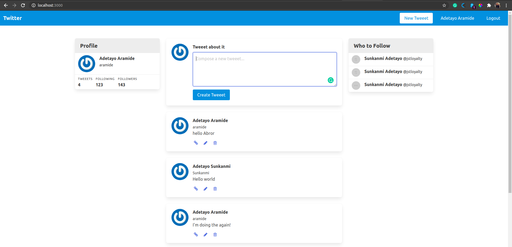

# TWITTER-DEMO

In this project, I build twitter on rails

<!--
*** Thanks for checking out this README Template. If you have a suggestion that would
*** make this better, please fork the repo and create a pull request or simply open
*** an issue with the tag "enhancement".
*** Thanks again! Now go create something AMAZING! :D
-->

<!-- PROJECT SHIELDS -->
<!--
*** I'm using markdown "reference style" links for readability.
*** Reference links are enclosed in brackets [ ] instead of parentheses ( ).
*** See the bottom of this document for the declaration of the reference variables
*** for contributors-url, forks-url, etc. This is an optional, concise syntax you may use.
*** https://www.markdownguide.org/basic-syntax/#reference-style-links
-->

[![Contributors][contributors-shield]][contributors-url]
[![Forks][forks-shield]][forks-url]
[![Stargazers][stars-shield]][stars-url]
[![Issues][issues-shield]][issues-url]

<!-- PROJECT LOGO -->
 

  

  <h3 align="center">Building form with Ruby on Rails</h3>

  

    This project is part of the Microverse curriculum in Ruby on Rails module!
     
    
    <a href="https://github.com/jstloyal/twitter_demo"><strong>Explore the docs »</strong></a>
     
     
    <a href="https://github.com/jstloyal/twitter_demo/issues">Report Bug</a>
    <a href="https://github.com/jstloyal/twitter_demo/issues">Request Feature</a>
  

<!-- TABLE OF CONTENTS -->

## Table of Contents

- [About the Project](#about-the-project)
- [Contributors](#contributors)
- [Live Version](#live-version)
- [Acknowledgements](#acknowledgements)
- [License](#license)

<!-- ABOUT THE PROJECT -->

## About The Project

I build a rails app called twitter_demo with a User model and Tweeet model.
Build a form for creating a new User and updating an existing User.
Each user can tweeet and see other users tweeet.
Each user can keep track of the number of their tweeets.

## Contributing

Contributions, issues and feature requests are welcome! Start by:

- Forking the project
- Cloning the project to your local machine
- `cd` into the project directory
- Run `git checkout -b your-branch-name`
- Make your contributions
- Push your branch up to your forked repository
- Open a Pull Request with a detailed description to the development branch of the original project for a review

### Built With

This project was built using these technologies.

- Ruby on Rails
- Rubocop
- Atom editor
- Git-Flow

## Contributors

**Author1**

​## Adetayo Sunkanmi

- Github: [@jstloyal](https://github.com/jstloyal)
- Twitter: [@jstloyalty](https://twitter.com/jstloyalty)
- Linkedin: [Adetayo Sunkanmi](https://www.linkedin.com/in/jstloyalty)
- E-mail: jstloyalty@gmail.com

<!-- ACKNOWLEDGEMENTS -->

## Acknowledgements

- [Microverse](https://www.microverse.org/)
- [The Odin Project](https://www.theodinproject.com/)
- [Rails Documentation](https://guides.rubyonrails.org/)

<!-- MARKDOWN LINKS & IMAGES -->
<!-- https://www.markdownguide.org/basic-syntax/#reference-style-links -->

[contributors-shield]: https://img.shields.io/github/contributors/jstloyal/twitter_demo.svg?style=flat-square
[contributors-url]: https://github.com/jstloyal/twitter_demo/graphs/contributors
[forks-shield]: https://img.shields.io/github/forks/jstloyal/twitter_demo.svg?style=flat-square
[forks-url]: https://github.com/jstloyal/twitter_demo/network/members
[stars-shield]: https://img.shields.io/github/stars/jstloyal/twitter_demo.svg?style=flat-square
[stars-url]: https://github.com/jstloyal/twitter_demo/stargazers
[issues-shield]: https://img.shields.io/github/issues/jstloyal/twitter_demo.svg?style=flat-square
[issues-url]: https://github.com/jstloyal/twitter_demo/issues

<!-- LICENSE -->

## License

📝
This project is [MIT](https://opensource.org/licenses/MIT) licensed.
